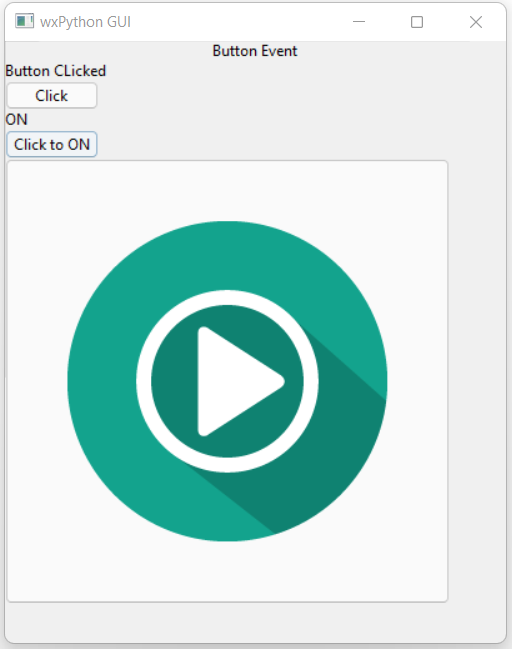
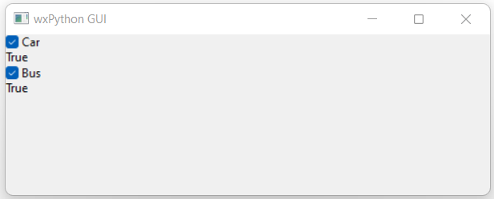
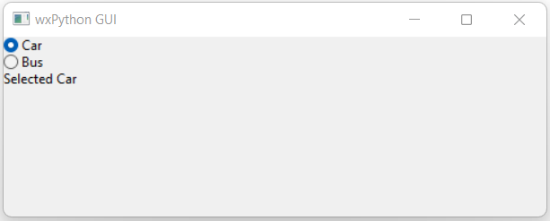
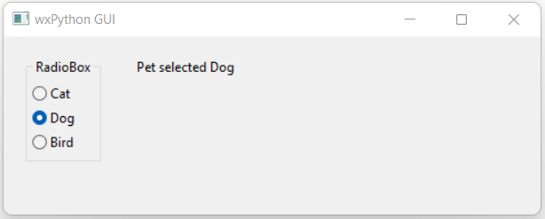
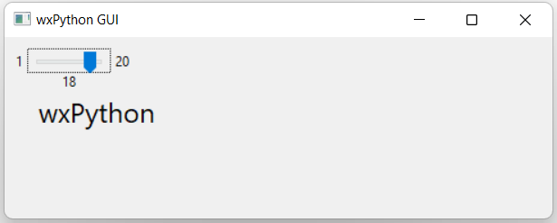
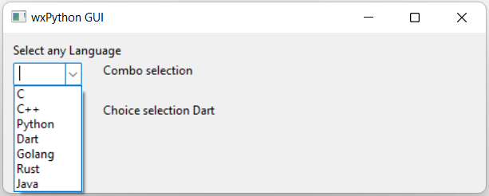
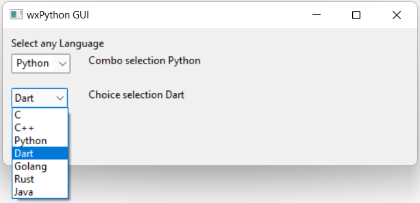

# wxpython_examples
This repo contains multiple number of wxPython examples

## Box Sizer 
  
check the [code](https://github.com/tm-sanjay/wxpython_examples/blob/f05ef1e9451f21a5fc4da00003ddb926963e1ac6/main.py#L10-L27)  

## Grid Sizer
  
Gridsizer with `label` as elements, chek the [code](https://github.com/tm-sanjay/wxpython_examples/blob/f05ef1e9451f21a5fc4da00003ddb926963e1ac6/main.py#L37-L44)

  
Gridsizer with `button` as elements, check the [code](https://github.com/tm-sanjay/wxpython_examples/blob/f05ef1e9451f21a5fc4da00003ddb926963e1ac6/main.py#L46-L49)

## Button Event
  
Button with click event, toggle, bitmap image. Check the [code](https://github.com/tm-sanjay/wxpython_examples/blob/273e2a55d8ed96001d5521890d6603fecac8985a/main.py#L55-L92)

## Checkbox Event
  
Check the [code](https://github.com/tm-sanjay/wxpython_examples/blob/9612b2576a952aeb5ca3b8c2aeb4e9fe54d1d9c6/main.py#L101-L132)

## RadioButton
  
Check the [code](https://github.com/tm-sanjay/wxpython_examples/blob/79d9db7218733c1bec6f9425ce7d381501b058a3/main.py#L135-L155)

## RadioBox
  
Check the [code](https://github.com/tm-sanjay/wxpython_examples/blob/79d9db7218733c1bec6f9425ce7d381501b058a3/main.py#L158-L169)

## Slider
  
Change the font size using slider, check the [code](https://github.com/tm-sanjay/wxpython_examples/blob/79d9db7218733c1bec6f9425ce7d381501b058a3/main.py#L172-L187)

## ComboBox & Choice
  
Choose an element form a list using comboBox and it is `editable`  

  
Choose an element form a list using choice and it is `read-only`, check the [code](https://github.com/tm-sanjay/wxpython_examples/blob/79d9db7218733c1bec6f9425ce7d381501b058a3/main.py#L189-L213)

## TextCtrl (Text Field)
  
TextCtrl 4 types: when enter, while typing, read-only & multiline. Check the [code](https://github.com/tm-sanjay/wxpython_examples/blob/79d9db7218733c1bec6f9425ce7d381501b058a3/main.py#L215-L240)  